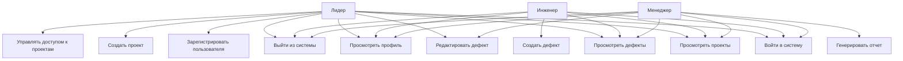
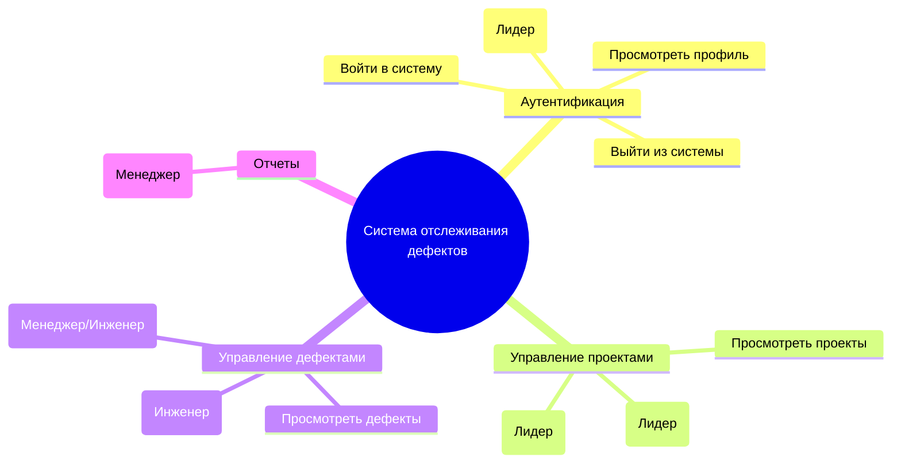

# Диаграммы проекта системы отслеживания дефектов

## Диаграмма прецедентов (Use Case Diagram)

## Диаграмма пользовательских историй (User Story Map)

## Пользовательские истории (User Stories)

### Лидер
- Как лидер, я хочу войти в систему, чтобы получить доступ к админ-функциям.
- Как лидер, я хочу зарегистрировать нового пользователя, чтобы предоставить доступ к системе.
- Как лидер, я хочу создать новый проект, чтобы организовать работу над ним.
- Как лидер, я хочу управлять доступом пользователей к проектам, чтобы контролировать права.
- Как лидер, я хочу просмотреть все проекты, чтобы отслеживать прогресс.
- Как лидер, я хочу просмотреть все дефекты, чтобы иметь полную картину.
- Как лидер, я хочу редактировать любой дефект, чтобы корректировать информацию.
- Как лидер, я хочу просмотреть свой профиль, чтобы обновить данные.
- Как лидер, я хочу выйти из системы, чтобы завершить сессию.

### Инженер
- Как инженер, я хочу войти в систему, чтобы начать работу.
- Как инженер, я хочу просмотреть доступные мне проекты, чтобы выбрать над чем работать.
- Как инженер, я хочу просмотреть дефекты в моих проектах, чтобы отслеживать статусы.
- Как инженер, я хочу создать новый дефект, чтобы сообщить о проблеме.
- Как инженер, я хочу редактировать дефекты, которые я создал или мне назначены, чтобы обновить информацию.
- Как инженер, я хочу просмотреть свой профиль, чтобы проверить данные.
- Как инженер, я хочу выйти из системы, чтобы завершить работу.

### Менеджер
- Как менеджер, я хочу войти в систему, чтобы управлять дефектами.
- Как менеджер, я хочу просмотреть проекты, к которым у меня есть доступ, чтобы планировать работу.
- Как менеджер, я хочу просмотреть дефекты в моих проектах, чтобы назначать исполнителей.
- Как менеджер, я хочу редактировать дефекты (назначать исполнителей, менять статусы), чтобы управлять процессом.
- Как менеджер, я хочу генерировать отчеты по дефектам, чтобы предоставить информацию руководству.
- Как менеджер, я хочу просмотреть свой профиль, чтобы обновить контактные данные.
- Как менеджер, я хочу выйти из системы, чтобы завершить сессию.
